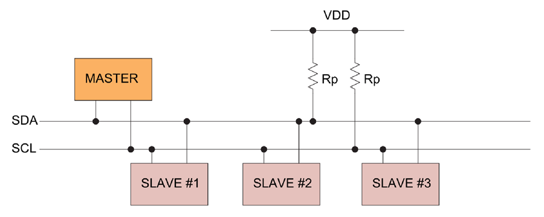
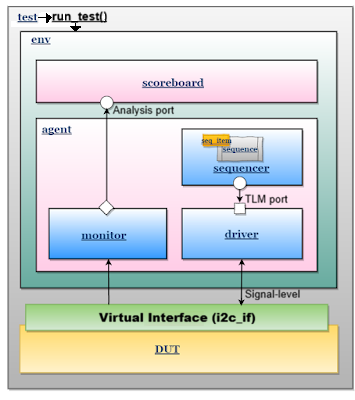
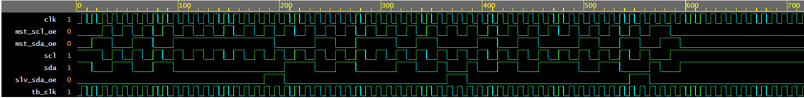
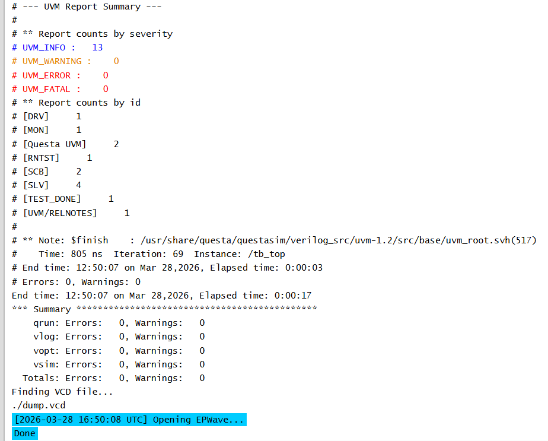
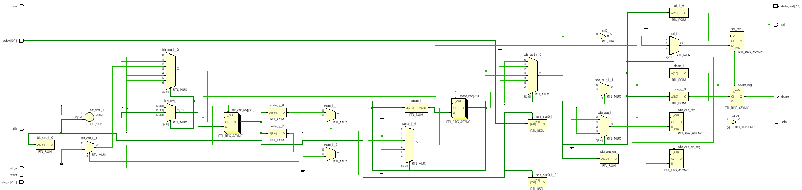

# UVM-Based Verification of I2C Controller
## Project Highlights

- Designed I2C Master Controller using FSM-based RTL
- Built complete UVM verification environment
- Verified protocol correctness using scoreboard
- Performed waveform-level validation of I2C signals
- Synthesized design in Vivado (RTL → Gate-level)
## Overview

This project presents a complete design and verification flow for the I2C (Inter-Integrated Circuit) protocol using SystemVerilog and Universal Verification Methodology (UVM). It demonstrates functional correctness at the transaction level, signal-level timing correctness through waveform analysis, and hardware realizability through RTL synthesis in Vivado.

The work combines digital design, protocol understanding, and industry-standard verification methodology to produce a complete VLSI design-and-verification project.

---

## Objectives

- Design an I2C Master Controller using RTL
- Build a reusable UVM verification environment
- Validate protocol correctness using transaction-level checking
- Perform waveform-based signal analysis
- Demonstrate hardware feasibility through RTL synthesis

---

## Repository Structure

```text
.
├── design.sv                         # I2C DUT (FSM-based controller)
├── i2c_if.sv                         # Interface (open-drain modeling)
├── i2c_uvm_pkg.sv                    # Complete UVM package
├── testbench.sv                      # Top-level testbench
├── run.do                            # Simulation script
├── README.md                         # Project documentation
│
├── Images/
│   ├── i2c_architecture.png
│   ├── uvm_I2C_block_diagram.png
│   ├── I2C_simulation_waveform.png
│   ├── UVM_OUTPUT.png
│   └── gate_level_synthesis_vivado.png
│
├── Reports/
│   ├── i2c_vlsi_testing_and_verification_final_report.pdf
│   ├── I2c_Protocol_explanation.pdf
│   └── uvm_explanation.pdf
```

---

## I2C Protocol Background

I2C is a synchronous serial communication protocol that uses two lines:

- SDA (Serial Data Line)
- SCL (Serial Clock Line)

### Key Characteristics

- Two-wire communication
- Master-slave architecture
- Open-drain signaling
- Acknowledgment-based protocol

### Communication Flow

1. START condition
2. 7-bit Address + R/W bit
3. ACK from slave
4. Data transfer
5. STOP condition

---

## I2C Bus Architecture



The I2C bus consists of a single master and multiple slaves connected via shared SDA and SCL lines. Pull-up resistors maintain default HIGH states, while devices actively pull lines LOW when needed.

---

## Design Description (DUT)

The Design Under Test (DUT) is a simplified I2C Master controller implemented using an FSM-based architecture.

### Key Functional Blocks

- START/STOP generation logic
- Address transmission logic
- Data transmission unit
- Bit counter
- Control FSM

### Key Behavior

- SDA changes only when SCL is LOW
- Data is stable when SCL is HIGH
- Open-drain behavior is modeled using tri-state logic

---

## Interface Design (`i2c_if.sv`)

The interface abstracts the physical I2C bus and models open-drain behavior.

### Core Logic

```systemverilog
assign sda = (mst_sda_oe || slv_sda_oe) ? 1'b0 : 1'bz;
```

### Interpretation

- If any device pulls SDA low, SDA becomes `0`
- If no device drives the line, SDA is released and pulled HIGH externally

This accurately models real I2C bus behavior.

---

## UVM Verification Methodology

UVM provides a modular and scalable verification environment.

### High-Level Architecture



---

## UVM Components

### Sequence Item
Defines a transaction:
- Address
- Data
- Operation (READ/WRITE)

### Sequencer
Controls the flow of transactions to the driver

### Driver
- Converts transactions to signal-level activity
- Drives DUT through virtual interface

### Monitor
- Observes signals passively
- Reconstructs transactions

### Scoreboard
- Compares expected vs observed data
- Determines PASS/FAIL

---

## Data Flow in Verification

1. Test calls `run_test()`
2. Sequence generates transactions
3. Driver drives DUT
4. Monitor captures activity
5. Scoreboard validates correctness

---

## Simulation Setup

Simulation is performed using QuestaSim:

```bash
qrun -batch -uvmhome uvm-1.2 design.sv testbench.sv -do run.do
```

---

## Simulation Waveform Analysis



### Observations

- Idle: SDA = HIGH, SCL = HIGH
- START: SDA falls while SCL is HIGH
- Address bits transmitted
- ACK received from slave
- Data bytes transferred
- STOP: SDA rises while SCL is HIGH

### Key Protocol Rules Verified

- SDA stays stable when SCL is HIGH
- SDA changes only when SCL is LOW
- Correct acknowledgment behavior is observed

---

## UVM Simulation Output



### Result Summary

- UVM_ERROR: 0
- UVM_FATAL: 0
- Test Result: PASS

### Interpretation

The simulation log confirms correct transaction execution, proper driver and monitor behavior, and scoreboard validation with no functional mismatches.

---

## Test Case Summary

| Parameter   | Value      |
|------------|------------|
| Address    | 0x50       |
| Operation  | WRITE      |
| Data Bytes | 0xA5, 0x5A |
| Result     | PASS       |

---

## RTL Synthesis (Vivado)



### Observations

- FSM implemented using registers
- Multiplexers used for control logic
- Bit counter manages serial transmission
- Tri-state buffers implement SDA open-drain behavior

This confirms that the design is hardware realizable and FPGA-compatible.

---

## Key Learnings

- UVM enables scalable verification environments
- Transaction-level modeling simplifies complexity
- Scoreboards ensure functional correctness
- Waveforms validate protocol timing
- RTL design maps correctly to hardware

---

## Future Work

- Add READ transactions
- Implement functional coverage
- Add multi-master support
- Add protocol error injection testing

---

## Tools Used

- SystemVerilog
- UVM 1.2
- QuestaSim
- EDA Playground
- Vivado

---

## Reports

This project is supported by detailed technical documentation covering design, protocol, and verification methodology:

- **Full Project Report**  
  Comprehensive documentation including design, UVM architecture, simulation, waveform analysis, and synthesis results  
  → [View Report](reports/i2c_vlsi_testing_and_verification_final_report.pdf)

- **I2C Protocol Explanation**  
  In-depth explanation of I2C communication, timing, and signal behavior  
  → [View Document](reports/I2c_Protocol_explanation.pdf)

- **UVM Methodology Explanation**  
  Detailed explanation of UVM architecture, components, and verification flow  
  → [View Document](reports/uvm_explanation.pdf)
---

## Authors

Mukund Rathi  
B.Tech Electronics and Communication Engineering  
IIIT Kottayam  

Aniketh Yuvaraj C.  

Faculty Mentor: Dr. Lakshmi N S

---

## Conclusion

This project demonstrates a complete VLSI verification flow, combining RTL design, UVM-based verification, waveform analysis, and hardware synthesis. The PASS result and zero-error simulation validate both functional correctness and verification robustness.
